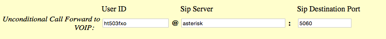

## Stopping Robocallers with Asterisk

Michael Pigg

-- 

## Motivation

-- ### The Problem
I have a (land line) phone line

-- ### The Real Problem

Companies think it's a great idea to

* have a computer call my phone <!-- .element: class="fragment" data-fragment-index="1" -->
* determine whether someone answers <!-- .element: class="fragment" data-fragment-index="2" -->
* have me wait while they connect me to an "agent" <!-- .element: class="fragment" data-fragment-index="3" -->
* and then have nothing important to say to me <!-- .element: class="fragment" data-fragment-index="4" -->

# WASTING MY TIME! <!-- .element: style="color: red" class="fragment" -->

-- ### Maybe An Answering Machine?

My answering machine thinks it recorded a message <!-- .element: class="fragment" -->

But it's really just silence or dial tone <!-- .element: class="fragment" -->

And I still have to listen to the phone ringing <!-- .element: class="fragment" -->

-- ### What Else?

Hire receptionist? <!-- .element: class="fragment" --> 


-- ### What Else?

~~Hire receptionist?~~ Too Expensive!

Use a VoIP service? <!-- .element: class="fragment" --> 

-- ### What Else?

~~Hire receptionist?~~ Too Expensive!

~~Use a VoIP service?~~ Not enough control!

Cut the Cord? <!-- .element: class="fragment" --> 

-- ### What Else?

~~Hire receptionist?~~ Too Expensive!

~~Use a VoIP service?~~ Not enough control!

~~Cut the Cord?~~ Too old!

-- 
# Epiphany!

-- ### Combine

* Asterisk <!-- .element: class="fragment" -->
* Linux running on BeagleBone Black <!-- .element: class="fragment" -->
* Appropriate telephony hardware <!-- .element: class="fragment" -->
* A bit of programming <!-- .element: class="fragment" -->

-- ### A System That

1. Answers phone <!-- .element: class="fragment" -->
1. Checks if caller is known or can prove they are real <!-- .element: class="fragment" -->
1. Forwards call to house phone only when proven valid <!-- .element: class="fragment" -->

-- 

## Hardware

-- ### Before


-- ### After


-- ### BeagleBone Black


* A small computer running Linux
* Fanless, low power
* Has an Ethernet port

-- ### GrandStream HT503 ATA


* Converts analog phone lines to digital (SIP)
  * FXO handles line from phone company
  * FXS handles internal (house) phones

-- ### HT503 FXO Settings

Configure server and credentials


-- ### HT503 FXO Settings

* Disable Ring Through to FXS
* Set to answer after two rings


-- ### HT503 Basic Settings

Enable unconditional call forward


-- ### HT503 FXS Settings

Configure server and credentials


-- ## Software

-- ### Playing With Asterisk

Will do development on Debian using Vagrant

```
vagrant init debian/jessie64
```

-- ## Configure VM

* Private network makes SIP connections easier

```
config.vm.network "private_network", ip: "192.168.33.10"
```


-- ### Provisioning
* Install Lua and Asterisk
* Customize Asterisk
  * remove default dialplan files (extensions.*)
  * remove default modules.conf
  * provide sip.conf, modules.conf, extensions.lua
  * copy custom message files
* Restart asterisk

-- 
Ansible Playbook
```
---
- hosts: all
  vars_files:
    - private/secrets.yml
  tasks:
    - name: install Lua
      apt: name=lua5.1 update_cache=yes cache_valid_time=86400
    - name: install asterisk
      apt: name=asterisk
    - name: get rid of extensions files
      file: path=/etc/asterisk/{{item}} state=absent
      with_items:
        - extensions.lua
        - extensions.conf
        - extensions.ael
        - modules.conf
        - sip.conf
    - name: copy files
      copy: src={{ item }} dest=/etc/asterisk/{{ item }} owner=asterisk group=asterisk
      with_items:
        - sip.conf
        - modules.conf
    - name: link up extensions.lua
      file: src=/vagrant/extensions.lua dest=/etc/asterisk/extensions.lua state=link owner=asterisk group=asterisk
    - name: config pwd 1
      ini_file: dest=/etc/asterisk/sip.conf section=ht503fxo option=secret value={{ht503fxo_pwd}}
    - name: config pwd 2
      ini_file: dest=/etc/asterisk/sip.conf section=ht503fxs option=secret value={{ht503fxs_pwd}}
    - name: copy sounds
      copy: src={{item}} dest=/usr/share/asterisk/sounds/custom/{{item}} owner=asterisk group=asterisk
      with_items:
        - ContinuePleasePress.wav
        - NotRecognized.wav
        - MainGreeting.wav
    - name: restart asterisk
      service: name=asterisk state=restarted
```

-- 
Crank It Up
```
vagrant up

vagrant ssh
```

-- 
Connect to Asterisk Console
```
sudo asterisk -rvv

Connected to Asterisk 11.13.1~dfsg-2+b1 currently running on debian-800-jessie (pid = 461)
debian-800-jessie*CLI> 
```


-- ### Essential Asterisk
* Channels
  * describe physical transports and devices
* Dialplan
  * the logic for handling calls

-- ### SIP Channel
* Session Initiation Protocol
  * Used extensively in VoIP systems
  * HT503 uses SIP protocol
* Provided by chan_sip module
* Configured in sip.conf

-- ### Configuring SIP Channels

```
; Grandstream HT503 FXO Port
[ht503fxo]              ; device id
context=pstn            ; context for calls coming from this device
type=peer               ; match requests on IP and port
username=ht503fxo       ; username for device 
secret=veryvyerysecret  ; password for device
host=dynamic            ; device registers with asterisk
qualify=yes             ; check that device is online

;Grandstream HT503 FXS Port
[ht503fxs]
context=internal
type=friend
username=ht503fxs
secret=supersecret
host=dynamic
port=5060
qualify=yes

```

-- ### Contexts

* Each device has a context
* Defines where in the dialplan a call is handled
* Contexts in this system
  * **pstn** for incoming calls
  * **internal** for outgoing calls

-- ### Dialplan

* Provides call handling logic
* Written in "GOTO Considered Harmful" style by default

```
[TestMenu]
    exten => start,1,Answer()
       same => n,Background(enter-ext-of-person)
       same => n,WaitExten(5)
    exten => 1,1,Playback(digits/1)
       same => n,Goto(TestMenu,start,1)
    exten => 2,1,Playback(digits/2)
       same => n,Goto(TestMenu,start,1)
```


-- ### Dialplan in Lua

`module load pbx_lua.so`

-- ### Basic Lua Dialplan
  
* Dialplans are expressed as Lua tables
* Lua tables are key value mappings 
  
```
--- define empty table
extensions = {}

--- add pstn context (table)
extensions.pstn = {}

--- add internal context (table)
extensions.internal = {}
```

-- ### Extensions

* An extension is defined in a context
* A key in a Lua table
* Each extension has logic for handling a call
* In Lua dialplan, that is expressed as a function
```
extensions.internal.["100"] = function()
  -- TODO: Handle call
end
```

-- ### Handling Outgoing Calls
* Call comes into `internal` context with the dialed number
* Need to forward it to the FXO port if it matches a PSTN number
* Extensions can be defined as patterns

```
extensions.internal["_.NXXNXXXXXX"] = function(context, ext)
 -- TODO: Forward to FXO
end
```

-- ### Dial Application

* One of the core Asterisk applications
* Sends a call to a transport and device

```
extensions.internal["_.NXXNXXXXXX"] = function(context, ext)
  -- call dialplan apps via "app." in Lua
  app.dial("SIP/ht503fxo".. ext)
end
```

-- ### Handling Incoming Calls
```
extensions.pstn["ht503fxo"] = function()
  if checkCall() then
    -- send call to internal phones
    app.dial("sip/ht503fxs")
  end
end
```

-- ### Getting Caller ID
* CALLERID dialplan function
  * CALLERID("number") to get number portion
  * CALLERID("name") to get name portion

-- ### Checking Calls
```
function checkCall()
  --- get number portion of caller ID
  cid = channel.CALLERID("number"):get()
  if isWhitelisted(cid) == false then
    return isRobot()
  end
  return true
end
```

-- ### Caller in Whitelist?
* Callers are put in whitelist
  * manually
  * when they pass the robot challenge
* Whitelist is maintained in Asterisk database

-- ### Asterisk database
* Organized in trees of families and keys
  * each family/key pair has a value
  * families are like tables

-- ### Caller Whitelist
* Stored in family "whitelist" with keys defined by CID
* Values are the timestamp that the record was written
* DB_EXISTS function tells us whether the caller is in the whitelist
  * Returns 1 if present, 0 if not

-- ### isWhitelisted()
```
function isWhitelisted(cid)
  if channel.DB_EXISTS("whitelist/" .. cid):get() == "1" then
    return true
  end
  return false
end
```

-- ### Robot Challenge

1. Answer the call
1. Play a greeting message
1. Ask caller to press a random number 0-9
1. Read pressed number (or timeout)
1. If correct, forward call, otherwise hangup

-- ### Answering A Call
```
function isRobot()
  -- answer the call so we can interact with caller
  app.answer()
end
```

-- ### Playing A Message
```
function isRobot()
  app.answer()
  -- play the sound file "greeting.wav"
  app.playback("greeting")
end
```

-- ### Getting A Random Digit
```
function isRobot()
  app.answer()
  app.playback("greeting")
  -- get a random number 0-9
  digit = channel.RAND(0,9):get()
end
```

-- ### Speak The Digit
```
function isRobot()
  app.answer()
  app.playback("greeting")
  digit = channel.RAND(0,9):get()
  -- say the number with a male voice
  app.saynumber(digit, "m")
end
```

-- ### Reading A Pressed Digit
```
function isRobot()
  app.answer()
  app.playback("greeting")
  digit = channel.RAND(0,9):get()
  app.saynumber(digit, "f")
  -- read a single digit
  -- store in a dialplan variable called "entered"
  app.read("entered", "", 1)
end
```

-- ### Check Entry
```
function isRobot()
  app.answer()
  app.playback("greeting")
  digit = channel.RAND(0,9):get()
  app.saynumber(digit, "f")
  app.read("entered", "", 1)
  -- get "entered" value from dialplan variable and compare
  return digit != channel.entered:get()
end
```

-- ### Real Life

* Let callers have a couple of chances
* Record callers in database
  * good callers in family "whitelist"
  * bad callers in family "robots"

-- ### Whitelist
Bless A Caller
```
database add whitelist 2155551212 "Fri May  8 10:30:00 2015"
```

View Whitelist
```
CLI> database show whitelist
/whitelist/6105551212                  : Thu May  7 09:06:55 2015 
/whitelist/2155551212                  : Fri May  8 10:30:00 2015  
2 results found.
```

Banish A Caller
```
database del whitelist 2155551212
```

-- ### Enhancements
* Automatic provisioning of ATA
* UI for managing lists
* Have whitelist for permanently good callers and graylist for those that pass robot challenge
* Send a message to iPhone when call coming in

-- 

## Resources

-- ### Asterisk
Main Project Site: [http://www.asterisk.org](http://www.asterisk.org)

Excellent Book: [http://www.asteriskdocs.org](http://www.asteriskdocs.org)

-- ### Vagrant

Vagrant: [https://docs.vagrantup.com](https://docs.vagrantup.com)

Ansible Docs: [http://docs.ansible.com/playbooks.html](http://docs.ansible.com/playbooks.html)

-- ### Code

[https://github.com/michaelpigg/roboscreen](https://github.com/michaelpigg/roboscreen )


